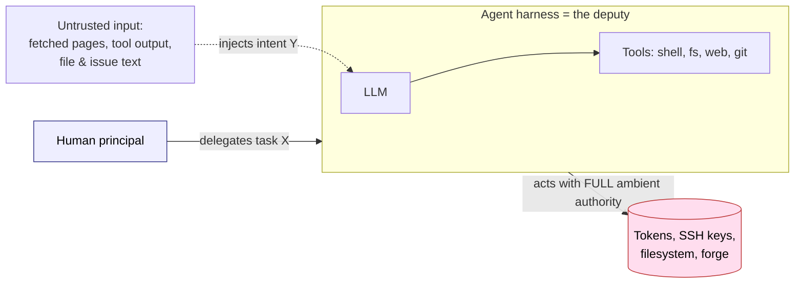
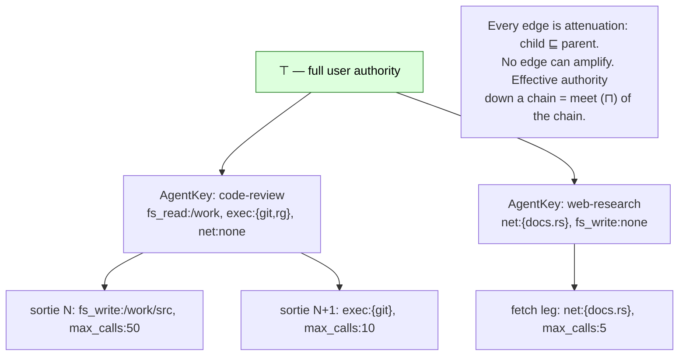
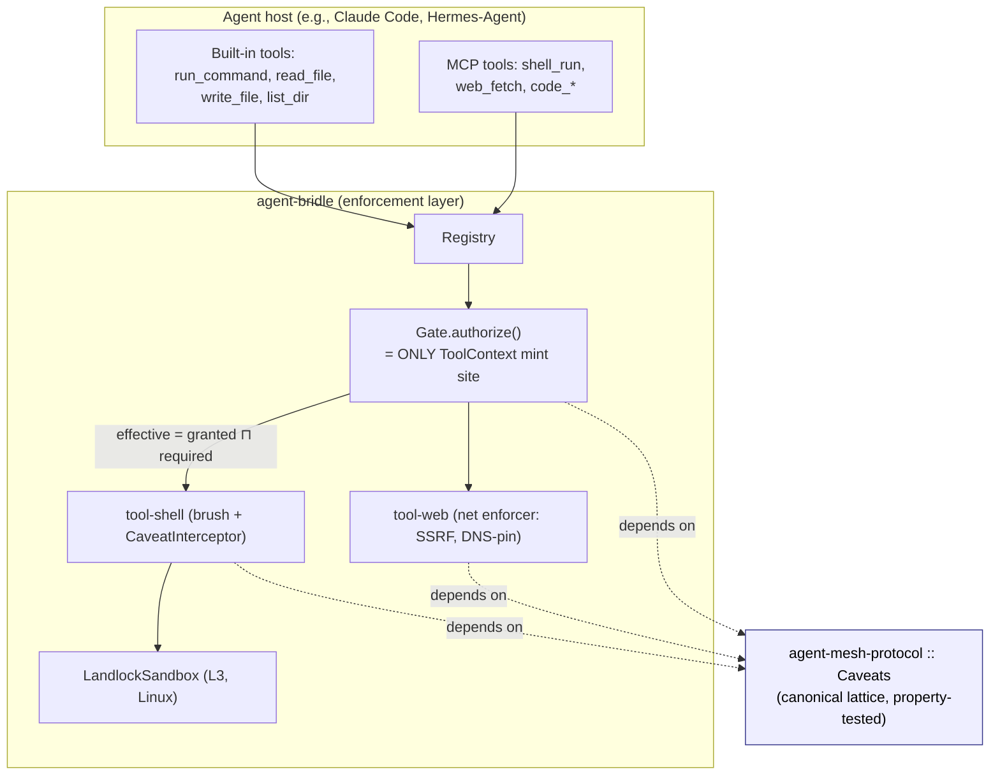
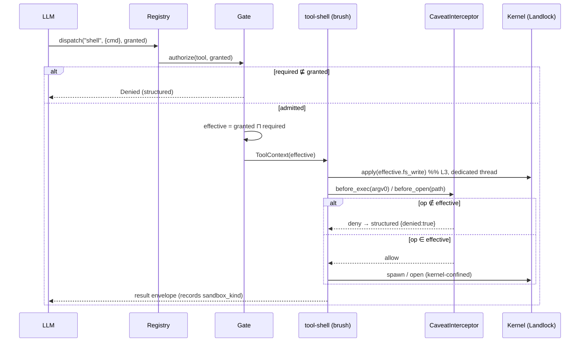
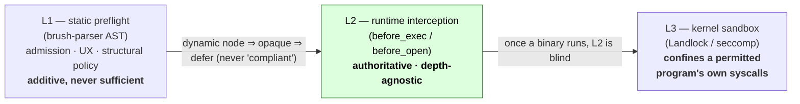
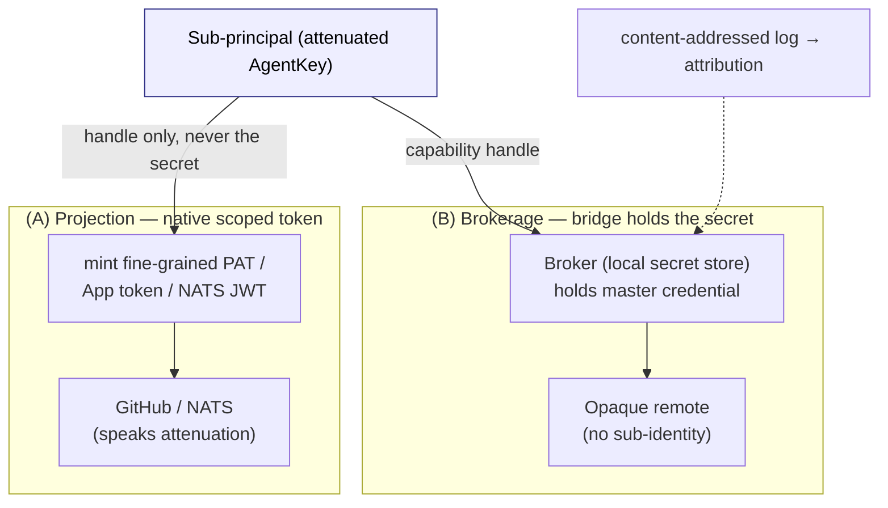

# The Age of the Confused Deputy

### Object-Capability Security for LLM Agent Harnesses

**Shawn Hartsock**
Gilamonster Foundation
`hartsock@acm.org`

> **Draft — defensive publication.** This paper describes a design that is
> partly shipped and partly in flight (see §7, *Implementation Status*). It is
> released openly as prior art, consistent with the project's preference for
> publication over patenting. Diagrams are Mermaid; a typeset ACM `sigconf`
> pass is a follow-up.

---

## Abstract

The dominant architecture for large-language-model (LLM) *agent harnesses* —
Claude Code, Codex, and Hermes-Agent among them — runs a program
with the **full identity and full ambient authority of the human operator** while
taking instruction from **untrusted channels**: the model's own continuation, tool
outputs, fetched web pages, and the text of files and issues. We address these
tools **as deployed by typical home users** — running on a personal workstation,
without an enterprise MDM, endpoint-policy infrastructure, or sandboxed deployment
environment. Enterprise deployments may layer additional controls; home users
typically receive none. This gap is where the harm is concentrated, and closing it
is the goal of this work. This is not a new class of vulnerability. It is Hardy's
1988 **confused deputy** [1] reproduced at machine speed and machine scale, with
prompt injection as the input channel and OAuth tokens, SSH keys, and a live shell
as the privilege. We argue that the prevailing mitigations — regex allow/deny lists
and prompt-injection detection — are *symptomatic*: they attempt to claw authority
back *after* identity and authority have been fused, and they collapse against
external systems that have no vocabulary for "a smaller version of me." We present an **object-capability
(ocap)** substrate that closes the gap *structurally*. Authority is modeled as a
bounded **meet-semilattice**; delegation is **attenuation-only**; and the
algebra contains no reachable amplify operation, so a fully compromised agent
*cannot* exceed the down-set of the capabilities it was minted with —
independent of whether the model behaves. We describe a working realization
across two crates: `agent-mesh-protocol` (the canonical `Caveats` lattice
type) and `agent-bridle` (a non-bypassable enforcement registry binding a
carried shell to the lattice), validated against a reference agent host. We
report on adversarial audits that found, and closed, two enforcement bypasses,
and we position the work against ocap, SPKI/SDSI, macaroons, Biscuit, Landlock,
and DeepMind's CaMeL. The thesis in one line: **the industry builds "agents," is
surprised they behave like confused deputies, and the cure is hidden in the
canonical name of the disease — deputize, do not empower.**

**CCS Concepts:** • *Security and privacy → Access control; Authorization;
Operating systems security.* • *Computing methodologies → Intelligent agents.*

**Keywords:** object-capability security, confused deputy, LLM agents, prompt
injection, attenuation, least authority, Landlock, capability lattice

---

## 1. Introduction

An *agent harness* is the software that lets an LLM act: it exposes tools
(shell, file I/O, web fetch, git, MCP servers), feeds the model their results,
and loops. The harness is, by construction, **maximally privileged** — it runs
as the user, with the user's tokens, keys, filesystem, and shell — and it is, by
construction, **steered by untrusted text**, because every channel it reads
(model output, tool results, fetched pages, repository contents) is attacker-
reachable. A single confused step can push to a forge, exfiltrate a secret, or
`rm -rf` a tree before a human notices.

The word "agent" is itself part of the trap. An *agent* has agency: it acts
autonomously, on its own behalf, with whatever power it can reach. The noun
pre-loads the failure mode. The 1988 literature did not name this problem the
"confused *agent*." It named it the confused **deputy** — and a deputy is the
cure stated as a noun. A deputy is *sworn in*, acts on behalf of a *named
principal*, and carries a *writ*: scoped, delegated, revocable authority. The
badge authorizes specific acts, not "whatever the bearer wants." That is
object-capability security in plain English: the writ is the capability, and the
capability is a key, not a name. The reframing matters because it changes the
pitch from "restrict your powerful autonomous agent" (security-as-tax) to
"deputize correctly for the task" (security-as-definition). Same engineering;
opposite emotional valence; and confusion stops being a bug you patch and
becomes *impossible by construction*.

This paper makes four contributions:

1. A precise restatement of the agent-harness security problem as the classical
   confused deputy, separating **identity** (who) from **authority** (what may
   be done) (§2–§3).
2. An **authority lattice** — a bounded meet-semilattice with attenuation-only
   delegation — and the proof obligation it discharges: a compromised agent
   cannot escalate (§4).
3. A **non-bypassable enforcement architecture** that binds an LLM's tool
   surface to that lattice via a mint-token discipline and a three-layer
   (static / runtime / kernel) defense, validated by adversarial audit (§5–§6).
4. The **external-systems resolution**: how local attenuation reaches systems
   (GitHub, NATS, Vault) that cannot represent sub-identities, via *projection*
   onto native scoped tokens or *brokerage* through a bridge (§5.4).

---

## 2. The Confused Deputy, Restated for Agents

### 2.1 Identity is not authority

Unix conflates two things that an agent harness must separate:

- **Identity** — *who* a process claims to be: a UID, an ed25519 key, a GitHub
  login.
- **Authority** — *what* it is permitted to do: its effective permission set.

The harness today runs with the user's identity **and** the user's full
authority, fused. Regex allow/deny lists are an attempt to claw authority back
*after* the fusion, at the boundary of each tool call, in each tool's own
vocabulary. That is precisely why they are brittle: they do not compose, and
they have nothing to say to a system that cannot represent sub-identities.

### 2.2 Hardy's deputy, at machine speed

Hardy's confused deputy [1]: a privileged program is tricked by a less-
privileged party into misusing its authority. The canonical example is a
compiler holding write permission to a billing file, which a caller tricks into
overwriting that file by naming it as the compiler's "output." The compiler is
never *compromised* — it does exactly what it was built to do. It is *confused*
about whose intent it serves.

The LLM agent harness is this deputy in its purest, highest-leverage form
(Figure 1). The model is told to do *X*; injected content in a fetched page or a
tool result redirects it to do *Y* using the same ambient authority; the harness
remains "confident" it is acting on the user's behalf. Prompt injection is,
literally, *confuse the deputy*.


*Figure 1. The agent harness as confused deputy: ambient authority on one side,
an untrusted instruction channel on the other. The attacker need not breach the
harness; it need only speak into a channel the harness already trusts.*

### 2.3 Ambient authority is the root cause

The disease is not "the model can be tricked." Models can always be tricked;
they are statistical text continuations reading adversarial text. The disease is
that **being tricked is catastrophic**, because the deputy holds far more
authority than the task requires. Mitigations aimed at the trickery —
prompt-injection classifiers, instruction-hierarchy training — are symptomatic.
The structural fix is to shrink the authority until confusion *cannot* be
exploited. That fix is object-capability security, and it has not yet been
systematically applied to agent harnesses. That gap is the opportunity.

---

## 3. Threat Model

**Deployment context.** We model the home-user scenario: an individual developer
running Claude Code, Codex, or Hermes-Agent on a personal workstation. The user
has no enterprise endpoint policy, no centrally-managed MDM sandbox, and no
deployment-level confinement beyond what the tool ships by default. Enterprise
deployments may apply additional OS-level or network-level controls; this paper
does not address those environments. Our claim is that a structural OCAP substrate
allows a home user to achieve an equivalent security posture using hardware they
already own — a Mac with Touch ID, a phone with a fingerprint reader — without
purchasing or managing enterprise security infrastructure.

We assume:

- **The model is untrusted as a control channel.** We do not assume it is
  malicious, but we assume it can be steered arbitrarily by injected content. No
  safety property may depend on the model "behaving."
- **All tool *inputs* are untrusted.** Fetched web content, file contents,
  issue/PR text, and the outputs of prior tool calls are attacker-reachable and
  are never spliced verbatim into a trusted context.
- **The harness binary and the enforcement core are trusted** (they are ours,
  built from source, hook-gated in CI).
- **The kernel is trusted** where it is the enforcement boundary (Landlock,
  user namespaces).

Out of scope for this paper: side-channels, compromise of the signing root key
(`UserKey`), and supply-chain attacks on the toolchain (addressed separately by
the project's hook-parity and provenance work).

The adversary's goal is privilege misuse: cause the deputy to read, write,
execute, or exfiltrate beyond the task's intended authority. Success is
*structurally* denied iff the effective authority handed to every tool
invocation is provably within the down-set of what the operator granted for the
task.

---

## 4. The Authority Lattice

### 4.1 Shapes that matter

The intuition "this is shaped like Unix root → groups → subusers" is right in
spirit, but the precise shapes tell you what is free and what is hard:

- **Principals form a tree (or DAG).** The operator issues sub-principals, each
  of which may issue their own. Our `agent-mesh` already has this seed: a
  `UserKey` (ed25519 root) issues `AgentKey`s via
  `AgentKey::issue(&user_key, AgentMetadata { .. })`.
- **Authority forms a bounded meet-semilattice** `(L, ⊑, ⊓, ⊤)` — *not* a tree.
  Capability sets are partially ordered by ⊆; the top element ⊤ is the user's
  full authority.
- **Delegation is a monotone-decreasing map (attenuation).** Minting a child is
  choosing any `A' ⊑ A(parent)`. There is **no upward operation in the
  algebra.**
- **Chains compose by meet.** A request flowing `p₁ → p₂ → p₃` carries effective
  authority `A(p₁) ⊓ A(p₂) ⊓ A(p₃) ⊓ caveats` — associative, commutative, with
  identity ⊤: a **commutative monoid under ⊓**.

The "usable by an LLM" property falls straight out of attenuation-only: because
no child can reach a join/amplify operation, a confused or compromised agent
*cannot* escalate. **Correctness of the worker model stops being a safety
dependency.**


*Figure 2. The principal tree carrying lattice elements. Each delegation edge is
a meet; the algebra has no inverse. A leaf sortie holds the least authority on
its branch.*

### 4.2 The canonical type

The lattice is not a diagram; it is a shipped Rust type,
`agent_mesh_protocol::Caveats`, with property-tested laws. There is exactly one
source of truth; `agent-bridle` *depends on* it and does not reinvent it.

```rust
pub struct Caveats {
    pub fs_read:  Scope<String>,   // paths readable
    pub fs_write: Scope<String>,   // paths writable
    pub exec:     Scope<String>,   // commands runnable
    pub net:      Scope<String>,   // hosts reachable
    pub max_calls: CountBound,            // ≤ N tool calls
    pub valid_for_generation: Scope<u64>, // causal, NOT wall-clock
}
```

Each axis is a `Scope` — either `All` (the ⊤ of that axis) or `Only(set)`.
Crucially:

- `leq` (`⊑`) is set inclusion; `meet` (`⊓`) is intersection with `All` as
  identity. The module proves `a ⊓ b ⊑ a` and `a ⊓ b ⊑ b` — **meet never
  amplifies** — by property test.
- Membership is **exact** at the lattice layer. Treating a path as a *prefix*
  that also authorizes descendants is an *enforcement* concern that belongs with
  Landlock, deliberately kept out of the algebra so the lattice laws stay clean.
- `valid_for_generation` keys on a **causal generation counter** ("valid for
  flight N"), never on wall-clock time — wall-clock is a claim, never a
  coordination primitive.

This is not novel mathematics. It is the formal core of object-capability
security [2,3], SPKI/SDSI (principals are *keys, not names*) [4], macaroons
(append-only caveats) [5], and Biscuit (`biscuit-auth`, Datalog caveats with
offline attenuation and signature verification) [6]. Our contribution is its
*application*: making it the single authority type that an LLM tool loop is
structurally unable to exceed.

---

## 5. System Architecture

Three layers of the stack realize the lattice, each a separate, independently
publishable crate:


*Figure 3. The stack. The host's tool surface is funneled through one registry
and one gate; the gate is the sole place a `ToolContext` (the token a tool needs
to do anything) can be minted; the lattice type is shared, not duplicated.*

### 5.1 Non-bypassable enforcement: the mint-token invariant

Two design moves make the leash *structural* rather than conventional:

1. **`ToolContext` is a mint-token.** Its fields are private; it is
   constructible **only** inside `agent-bridle-core`'s `Gate::authorize()`. A
   `Tool` needs a `ToolContext` to do anything. Therefore the only path to
   running a tool is `dispatch → gate.authorize → ToolContext` — a tool
   *cannot* run without having passed the leash. Enforcement by construction,
   checked by the compiler (`compile_fail` tests prove the token cannot be
   forged outside the gate).

2. **Effective authority = `granted.meet(required)`.** The gate hands the tool
   the *meet* of what the session was granted and what the tool *declared* it
   needs — least authority by construction, provably safe via the
   `meet_never_amplifies` law.

```rust
impl Gate {
    pub fn authorize(&self, tool: &dyn Tool, granted: &Caveats)
        -> Result<ToolContext, ToolError> {
        if !tool.required().leq(granted) { return Err(ToolError::Denied(..)); }
        let effective = granted.meet(&tool.required()); // least authority
        self.budget.charge_one()?;                       // max_calls
        self.check_generation(granted)?;                 // valid_for_generation
        Ok(ToolContext::mint(effective, self.sandbox_kind)) // ONLY mint site
    }
}
```

### 5.2 The enforcement sequence


*Figure 4. One tool call. Admission (lattice `⊑`), least-authority narrowing
(`⊓`), runtime interception at each spawn/open, and a kernel backstop — every
result records which sandbox actually enforced it, so we never overclaim.*

### 5.3 Three enforcement layers (ADR 0001)

The shell is dynamic and Turing-complete (`eval "$x"`, `$(curl|sh)`,
`cmd=$(pick); $cmd`). A static analyzer therefore *cannot soundly* decide what a
deep interior will do — that is undecidability, not a tooling gap — and any
analyzer that *guesses* "compliant" has created a false-confidence bypass. The
ocap stance is to **attenuate, not predict**: you need not understand
`eval "$x"` if `x` cannot reach anything dangerous. Enforcement is therefore
layered, with the authoritative layer being runtime, never static:


*Figure 5. L1 reduces partial side effects and explains decisions but can never
clear what L2/L3 would deny; L2 is ground truth at the point of use; L3 is the
only layer that can confine a permitted external program's interior. No layer's
verdict overrides a more authoritative one.*

### 5.4 The external-systems crux — and why it dissolves

The hard part: external systems (GitHub) will not let one identity decompose
into many limited ones. The move is to **stop trying to make them.** There are
only two kinds of external system, and a different mechanism for each (Figure 6):

- **(A) Systems with a native attenuation primitive.** *Project* the local
  sub-principal onto what the system already speaks: GitHub fine-grained PATs and
  App installation tokens (short-lived, per-repo, per-permission); NATS account
  → user JWTs (a delegation hierarchy in the protocol itself); Vault policies (a
  lattice). This is a one-way transform from an authority into a derived, scoped
  view that carries provenance — a *projection*, not a sync.

- **(B) Systems that offer nothing.** Never let the sub-principal touch the
  system. The master credential stays in a **credential broker** (a local secret
  store — Vault, macOS Keychain, or equivalent). The sub-principal holds only a
  *handle* — "I may invoke operation *X* through the broker" — and the broker
  re-identifies as the full user at the boundary. The remote sees one identity;
  **attribution is reconstructed from the broker's content-addressed log, not from
  the remote's identity field.**


*Figure 6. Attenuate once, locally, in a single algebra; reach the world only by
projecting onto a token you minted, or by brokering through a bridge that holds
the real secret and re-identifies as you. The decomposition is yours and stays
home.*

The operative principle: **secrets never move** (the child gets a capability, not
a secret); sub-principals push to local storage and exactly one narrow, audited
*release-to-bridge* gate runs as the full identity to project approved work
outward; and **generation counters, not wall-clock**, key every caveat.

---

## 6. Why This Is Safer Than the Alternatives

| Approach | Composes? | Sound against dynamic shells? | Survives a fully-tricked model? | External-system story |
|---|---|---|---|---|
| **Regex allow/deny per tool** | No (per-tool vocab) | No (`a && rm` slips a leading-token check) | No | None — can't express sub-identity |
| **Prompt-injection detection** | N/A | N/A | No (best-effort classifier) | None |
| **Static command analysis** | Partially | **No (undecidable)** — false-confidence bypass | No | None |
| **Approval prompts ("are you sure?")** | No | No | No (habituation; speed defeats it) | None |
| **Ocap attenuation (this work)** | **Yes (meet)** | **Yes — attenuate, don't predict** | **Yes (structural)** | **Projection / brokerage** |

The decisive row is the third column. Every approach above the last line places
its bet on *the model not being tricked* or on *predicting what code will do*.
Both bets lose at machine scale. The ocap bet is that even a fully-tricked model
holds too little authority to cause harm — a property of the *algebra and the
kernel*, not of the model. The cost is real (the operator must deputize for the
task instead of running with ⊤), but it is the only cost that buys a *structural*
guarantee.

A worked example, drawn directly from our regression suite: under
`exec: Only{echo}`, the command `echo ok && rm -rf victim` runs `echo` and then
**denies `rm`** — `victim` survives. A leading-token regex check (the pre-bridle behavior of a typical MCP shell
tool) cleared on `echo` and ran the whole `sh -c` string, deleting the tree. The lattice gate checks the actual `rm` spawn at the point of use,
regardless of nesting depth.

---

## 7. Implementation Status and Adversarial Findings

The substrate is largely shipped; full kernel enforcement and the Python pillars
are in flight.

- **`agent-mesh-protocol :: Caveats`** — published (crates.io; Python binding on
  PyPI). The lattice, its laws, and `Scope`/`CountBound` axes are live and
  property-tested.
- **`agent-bridle`** — six crates published/published-pending: `core` (gate +
  mint-token + `meet`-based least authority), `tool-shell` (a carried
  bash-in-Rust runtime, *brush*, with a `CaveatInterceptor`), `tool-web` (the
  `net` enforcer: default-deny host allowlist, SSRF screening, DNS pinning,
  per-redirect re-check), the facade, the MCP frontend, and the PyO3 wheel.
- **Reference host** — both tool surfaces (a TUI `run_command` and an MCP
  `shell_run`) now dispatch through the bridle gate; an L3 Landlock ruleset
  confines the `fs_write` axis on Linux for external programs.

**Two enforcement bypasses were found by adversarial, empirical audit — not by
structural reasoning — and closed.** They are the standing evidence that runtime
(L2) and kernel (L3) enforcement are necessary and that static reasoning (L1)
can never be trusted alone:

1. **The `exec` builtin bypass.** The carried shell's `exec` builtin called
   `cmd.exec()` (replace-process) *directly*, skipping the `before_exec` hook.
   Proven live: under `exec: Only{echo}`, `exec /usr/bin/touch MARKER` ran
   `touch`. Fix: a curated builtin set that omits `exec`
   (robust-by-construction — a confined shell has nothing to replace into).
2. **The dangling-symlink `fs_write` escape.** Check-time canonicalization used
   an existence probe that *followed* symlinks, so a symlink whose target did not
   yet exist canonicalized to itself (in-scope), while `open(O_CREAT)` wrote
   *through* it out-of-scope. Fix: no-follow resolution (`lstat`/`O_NOFOLLOW`,
   bounded symlink-hop resolution) plus a regression test that fails on the old
   code.

Both bugs shared one root cause — **the structural/expected view diverging from
runtime reality** — which is exactly why the design makes the *runtime* layer
authoritative and treats every static verdict as advisory.

### 7.5 Human-Presence Capabilities and the Self-Governing Lattice (in flight)

§4's decision is two-valued: a tool call lies within the grant's down-set or it
does not. Operating the deputy across substrates — a homelab, AWS, Azure, GCP,
all under one human — surfaces a third outcome the binary cannot express:
*authorized, but only with a fresh, non-repudiable act of human presence.* We
surface it as `attest`, discharged by a WebAuthn/FIDO2 assertion. Crucially, the
required authenticator is **hardware most home users already own**: macOS Touch ID
(built into every Apple Silicon Mac), Face ID or a fingerprint reader on any
modern Android or iPhone, or Windows Hello on a fingerprint-equipped laptop. A
dedicated hardware key (YubiKey) works too but is not required — the design
targets the passkeys and biometric readers that ship with consumer devices, not
the security-professional stack. `agent-mesh-protocol` is designed to work with
these common authenticators directly, so the barrier to entry is a software
install, not a hardware purchase. Crucially it is **not a new authority.** An
`attest` discharge adds nothing to the grant — `effective = granted.meet(required)`
is unchanged — it sharpens only the *liveness condition* under which the **same**
Writ is exercised: from "ambient, on the agent's say-so" to "live, on the human's
hand." At the decision surface it reads as a third option beside *allow* and
*deny*; in the authority algebra it is a **constraint** — an extension of
**Refusal** into "the human did not consent" — which is precisely why it cannot
break attenuation (§4).

**Three decisions, one mutation.** The operator-facing choice is a polarity —
**{allow, attest, deny}** — under a single ephemeral⇄persistent mutation.
*Ephemeral* binds the outcome to the current causal generation (§4's counter,
never wall-clock); *persistent* writes a standing rule. The familiar prompt —
*yes once / yes always / yes on passkey / no once / no always* — is exactly these
three decisions under one mutation, not five independent choices.

**The keystone: mutating the lattice is itself a capability.** A standing *allow*
**widens future authority** — the one move the meet-semilattice forbids locally
(§4: no reachable amplify). The resolution is reflexive: *the authority to mutate
policy is itself a capability in the lattice.* Attenuating it — a tighter rule, a
*deny* — needs only ordinary authority and is always permitted (the dual of "a
deputy may shrink its own writ"). **Amplifying it — a standing *allow* that
enlarges the down-set — requires the human root, surfaced as an `attest` gated by
a passkey.** The lattice thereby governs its own evolution, and the single most
dangerous act — an agent loosening its own leash — is the one most tightly bound
to a human gesture. Confusion cannot widen the writ; neither can autonomy.

**Reflexive governance scales to the enterprise.** Because the policy object is
itself capability-governed, an administrator can ship a **signed policy
artifact** — the exact grant the organization's workers receive — and withhold
the mutation capability: a worker may *attenuate* its own leash (always safe) but
cannot *persist* or *amplify* without the admin root. The two postures an
operator might want — "only the admin may alter persistent state" versus "only
the admin may alter the policy at all" — are simply two points on the worker's
permitted mutation range, `{none, attenuate-only, ephemeral-only, full}`, both
expressible in one algebra. This is MDM/group-policy semantics rebuilt as an
attenuation-only lattice with a human-presence root, and it repairs a concrete
gap in the current enforcement boundary: the bridle's MCP grant is loaded today
from an unsigned environment variable and defaults *open* — a signed,
admin-rooted, fail-closed policy is the structural fix.

**Anti-theater: what-you-see-is-what-you-sign.** An `attest` prompt the agent can
patch out is theater. The assertion's challenge is bound to the specific act —
`BLAKE3(domain ‖ tool ‖ canonical(args) ‖ resource ‖ generation ‖ nonce)`, with
`args` resolved (realpath, refspec) *before* hashing — so the human authorizes
*that* effect, not a generic yes, and the verified assertion becomes a
content-addressed provenance attestation (credential id, challenge, generation,
signature). This matters because the client-side gate is, by itself,
**advisory**: a patched harness can skip it. The teeth come from layering
enforcement planes — the bridle `Gate` is the fail-fast, honest-path gate and
keeps the effect off any unleashed shell, while the **guarantee** lives where the
agent's process cannot reach: in hardware that will not sign without the gesture,
and in an **effect-side verifier** (a git `pre-receive` hook, a send-relay, a
mesh peer) that recomputes the challenge from the *actual* effect and rejects it
unless a valid attestation rides along. Same challenge formula on both planes;
one attestation satisfies both.

**Closing §3's out-of-scope item — the root of trust.** §3 placed *compromise of
the signing root key (`UserKey`)* out of scope; human-presence capabilities let
us address its **bootstrap**. Two paths, one root. **(A)** the operator's existing
public key, published at `github.com/<user>.keys`, **anchors identity only** — it
cross-signs the root's fingerprint so any peer can verify "this root is the
human's," but, being an ordinary SSH key spanning all of a user's devices, it is
*not* the CA and never signs a `CertChain`. **(B)** for an operator with no
published key, a passkey **mints and seals** the root: the software Ed25519
`UserKey` is generated normally and its private half sealed at rest under a key
derived from the authenticator's **PRF/`hmac-secret`** extension, unsealed only by
the human gesture. The passkey is structurally *disqualified* as the CA key
itself — it signs only the fixed `authenticatorData ‖ H(clientData)`, only ES256,
only with a live gesture — so it is the **unsealing gate and presence proof, never
the signer.** "Touch-to-push" is then just `attest` wired to the most common
irreversible effect: a FIDO2-backed `ed25519-sk` key whose CA cert omits
`no-touch-required`, so the hardware refuses to authenticate the push without a
human touch. (Two boundaries are firm and load-bearing: synced iCloud/Google
passkeys *cannot* serve as SSH `sk-keys`, and a built-in Touch ID is not an
`sk-key` authenticator — so the agent-proof guarantee rests on a roaming hardware
key plus the server-side hook, not on any software ceremony alone.)

---

## 8. Related Work

The confused deputy is Hardy [1]; the capability answer descends from Dennis &
Van Horn [2] through KeyKOS, EROS, and seL4 [7], and is crystallized for
distributed systems by Miller's object-capability model [3]. **SPKI/SDSI** [4]
contributes "keys, not names," which is exactly how we sidestep "GitHub doesn't
know my sub-users." **Macaroons** [5] contribute append-only caveats (attenuate
by stapling restrictions you can add but never peel); **Biscuit** [6] is the
Rust-native, offline-attenuable, signed realization we treat as the most direct
off-the-shelf fit. **Landlock** [8] gives an unprivileged process a one-syscall,
irreversible drop of its own filesystem authority — attenuation-by-construction
in the kernel — and is our L3.

The closest contemporary art is DeepMind's **CaMeL** [9], which also rejects
"ask the model to behave" and instead confines an agent by construction. We
differ in mechanism and scope: CaMeL derives a capability/data-flow policy
around the model's plan; we make the *authority itself* a shared lattice type
enforced at a non-bypassable gate and, distinctively, address the
**identity-monolithic remote** problem (§5.4) via projection and brokerage with
content-addressed, causal-clock re-attribution — the part we believe is least
anticipated by prior work.

---

## 9. Discussion

**Publish, not patent.** This synthesis has plausible patentable elements
(per-sortie key-rooted sub-principals; one signed caveat set enforced at two
layers; projection/brokerage across identity-monolithic remotes with
content-addressed re-attribution). We choose **defensive publication**. A patent
is an instrument of exclusion; it conflicts with the project's core values — no
lock-in, plain text, tools replaceable, *"the tool is a telescope, not the
sky."* The world needs this more than we need to fence it.

**A cruel symmetry.** The confused deputy is a deeper problem compressed to a
single transaction. *Power is transferable; wisdom is not.* Power lives outside
the self — authority, credentials, keys, root, trained weights — so it delegates
perfectly; judgment lives in a self colliding with consequence over time, so it
does not delegate at all. The confused deputy is that asymmetry failing across
*one* delegation; the same failure across *generations* is how institutions and
people, not only programs, go wrong. Since you cannot ship judgment alongside
power, ship *less power* — attenuate the capability until it no longer requires
the judgment it cannot inherit. "Keys-not-keyrings" and "wisdom-doesn't-inherit"
are the same theorem at two time-constants. Even the LLM's apparent escape hatch
— copyable weights — does not break it: the deputy can hold the entire model and
still be confused, because the missing thing is *situated judgment relative to
the specific grant*, not a static blob of capability.

---

## 10. Conclusion

The age of the confused deputy is here because we built agents — programs with
agency and ambient authority — and acted surprised when untrusted text steered
them. The fix is not better prompts or better classifiers; it is the noun we
skipped. Deputize: issue a scoped, revocable writ; make authority a lattice that
only attenuates; enforce it at a gate no tool can bypass and a kernel no program
can escape; and reach the outside world only by minting a token or brokering
through a bridge. Then a fully compromised agent is merely a deputy with a small
badge — confused, perhaps, but harmless by construction. That is the whole
program, and most of it already runs.

---

## References

[1] N. Hardy. *The Confused Deputy (or why capabilities might have been
invented)*. ACM SIGOPS Operating Systems Review, 22(4), 1988.

[2] J. B. Dennis and E. C. Van Horn. *Programming Semantics for Multiprogrammed
Computations*. Communications of the ACM, 9(3), 1966.

[3] M. S. Miller. *Robust Composition: Towards a Unified Approach to Access
Control and Concurrency Control*. PhD thesis, Johns Hopkins University, 2006.

[4] C. Ellison et al. *SPKI Certificate Theory*. IETF RFC 2693, 1999.

[5] A. Birgisson et al. *Macaroons: Cookies with Contextual Caveats for
Decentralized Authorization in the Cloud*. NDSS, 2014.

[6] G. Fournier et al. *Biscuit: a bearer token with offline attenuation and
Datalog-based caveats*. `biscuit-auth`, 2021–.

[7] G. Klein et al. *seL4: Formal Verification of an OS Kernel*. SOSP, 2009.

[8] M. Salaün. *Landlock: unprivileged access control for Linux*. Linux kernel,
2021–.

[9] E. Debenedetti et al. *Defeating Prompt Injections by Design (CaMeL)*.
Google DeepMind, 2025.

---

*Source artifacts: `agent-bridle/docs/DESIGN.md`,
`agent-bridle/docs/adr/0001-command-decomposition-and-ocap-layers.md`,
`agent-mesh-protocol/src/caveats.rs`. Repository:
`github.com/Gilamonster-Foundation/agent-bridle`. Companion essays: "Beyond
Agents: Deputies" and "The Cruel Symmetry."*
